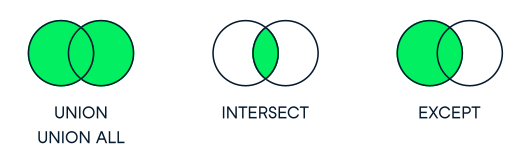

# Joins

In relational databases, a **join** is an operation that combines rows from two or more tables based on a related column between them. Joins are fundamental to relational databases, allowing users to retrieve data from multiple tables in a single query. By linking tables together, joins enable the database to present a unified view of the data, facilitating complex queries and data analysis.

There are six main types of joins:

- INNER JOIN
- LEFT JOIN (or LEFT OUTER JOIN)
- RIGHT JOIN (or RIGHT OUTER JOIN)
- FULL JOIN (or FULL OUTER JOIN)
- CROSS JOIN
- SELF JOIN


## Definitions


- **Primary key**: A primary key is a field in a table that uniquely identifies each record in the table. In relational databases, primary keys can be used as fields to join tables on.
- **Foreign key**: A foreign key is a field in a table which references the primary key of another table. In a relational database, one way to join two tables is by connecting the foreign key from one table to the primary key of another.
- **One-to-one relationship**: Database relationships describe the relationships between records in different tables. When a one-to-one relationship exists between two tables, a given record in one table is uniquely related to exactly one record in the other table.
    > This is typically implemented by adding a foreign key in one of the tables. (e.g., a `user_id` in a `profile` table)

- **One-to-many relationship**: In a one-to-many relationship, a record in one table can be related to one or more records in a second table. However, a given record in the second table will only be related to one record in the first table.
    > This is typically implemented by adding a foreign key in the table with the "many" side of the relationship. (e.g., a `user_id` in a `post` table)

- **Many-to-many relationship**: In a many-to-many relationship, records in a given table ‘A’ can be related to one or more records in another table ‘B’, and records in table B can also be related to many records in table A.
    > This is typically implemented using a join table. (e.g., a `user_id` and `group_id` in a `user_group` table)

## Sample Data

> `artists` tables

| id | name              |
|----|-------------------|
| 1  | AC/DC             |
| 2  | Accept            |
| 3  | Aerosmith         |
| 4  | Alanis Morissette |
| 5  | Alice In Chains   |

> `albums` tables

| id | title                   | artist_id |
|----|-------------------------|-----------|
| 1  | For Those About To Rock | 1         |
| 2  | Balls to the Wall       | 2         |
| 3  | Restless and Wild       | 2         |
| 4  | Let There Be Rock       | 1         |
| 5  | Big Ones                | 3         |


## Inner Join

An **inner join** between two tables will return only records where a joining field, such as a key, finds a match in both tables.

```sql title="Explicit Inner Join"
SELECT artists.name, albums.title
FROM artists
INNER JOIN albums
ON artists.id = albums.artist_id;

-- Inner Join with Using
SELECT artists.name, albums.title
FROM artists
INNER JOIN albums
USING (artist_id);
```

```sql title="Implicit Inner Join"
SELECT artists.name, albums.title
FROM artists, albums
WHERE artists.id = albums.artist_id;
```

## Self Join

Self-joins are used to compare values in a table to other values of the same table by joining different parts of a table together.

```sql title="Explicit Self Join"
SELECT a1.name AS artist, a2.name AS collaborator
FROM artists a1
INNER JOIN artists a2
ON a1.id != a2.id;
-- this will return all possible pairs of artists that are not the same
```

```sql title="Implicit Self Join"
SELECT a1.name AS artist, a2.name AS collaborator
FROM artists a1, artists a2
WHERE a1.id != a2.id;
```

:::note Implicit vs Explicit Joins
- In the implicit join, the join condition is specified in the WHERE clause, whereas in the explicit join, the join condition is specified in the JOIN clause.
- Implicit joins are limited to creating inner joins because they do not support outer joins (`LEFT JOIN`, `RIGHT JOIN`, `FULL JOIN`).
:::

## Left Join

A **left join** returns all records from the left table and the matched records from the right table. If there is no match, the result is `NULL`.

```sql
SELECT artists.name, albums.title
FROM artists
LEFT JOIN albums
ON artists.id = albums.artist_id;
```

## Right Join

A **right join** returns all records from the right table and the matched records from the left table. If there is no match, the result is `NULL`.

```sql
SELECT artists.name, albums.title
FROM artists
RIGHT JOIN albums
ON artists.id = albums.artist_id;
```

:::tip
- `LEFT JOIN` and `RIGHT JOIN` are equivalent and can be used interchangeably by swapping the order of the tables.
- `LEFT JOIN` is more commonly used than `RIGHT JOIN`.
- `FULL JOIN` is not supported in all SQL databases (e.g., MySQL), so `LEFT JOIN` and `RIGHT JOIN` are used instead.
- `FULL JOIN` can be emulated by combining a `LEFT JOIN` and a `RIGHT JOIN` with a `UNION`.
- In `LEFT JOIN`, the left table is the table that appears before the `LEFT JOIN` keyword, and the right table is the table that appears after the `LEFT JOIN` keyword.
- In `RIGHT JOIN`, the left table is the table that appears before the `RIGHT JOIN` keyword, and the right table is the table that appears after the `RIGHT JOIN` keyword.
:::

## Full Join

A **full join** returns all records when there is a match in either the left or right table. If there is no match, the result is `NULL`.

```sql
SELECT artists.name, albums.title
FROM artists
FULL JOIN albums
ON artists.id = albums.artist_id;
```

## Cross Join

A **cross join** returns the Cartesian product of two tables, i.e., all possible combinations of rows from the two tables.

```sql title="Explicit Cross Join"
SELECT artists.name, albums.title
FROM artists
CROSS JOIN albums;
```

```sql title="Implicit Cross Join"
SELECT artists.name, albums.title
FROM artists, albums;
```

:::note
- Cross joins can be computationally expensive because they generate a large number of rows.
- Cross joins are used when you want to combine every row from one table with every row from another table.
- Cross joins are not commonly used in practice because they can lead to performance issues.
:::

## Set Theory Operators



- **UNION**: Combines the results of two or more SELECT statements into a single result set.

    ```sql
    SELECT id from artists
    UNION
    SELECT artist_id from albums;
    ```

- **UNION ALL**: Combines the results of two or more SELECT statements into a single result set, including duplicate rows.

    ```sql
    SELECT id from artists
    UNION ALL
    SELECT artist_id from albums;
    ```

- **INTERSECT**: Returns all distinct rows that are in both the result sets of two SELECT statements.

    ```sql
    SELECT id from artists
    INTERSECT
    SELECT artist_id from albums;
    ```
  
- **EXCEPT**: Returns all distinct rows that are in the result set of the first SELECT statement but not in the result set of the second SELECT statement.
    
    ```sql
    SELECT id from artists
    EXCEPT
    SELECT artist_id from albums;
    ```
